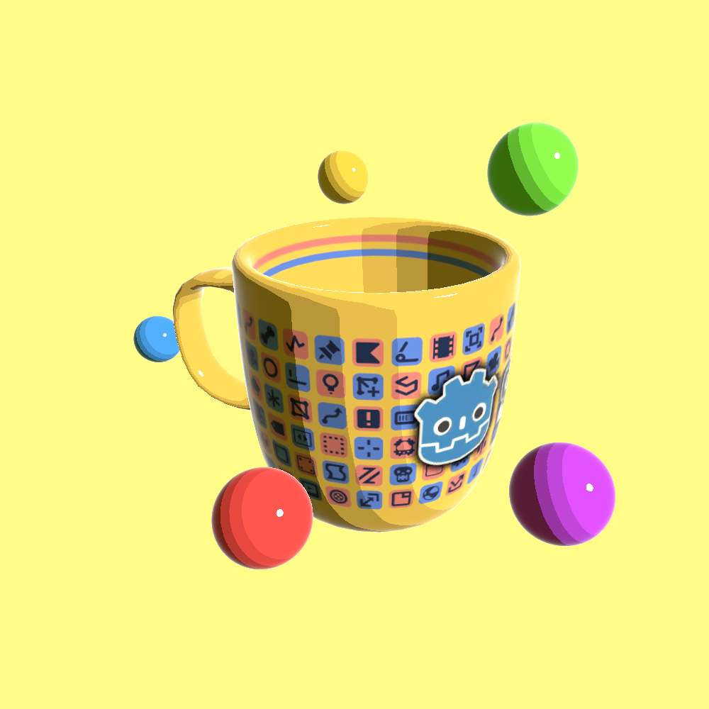
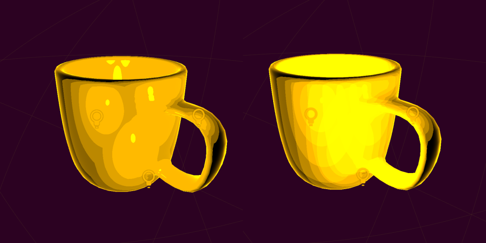
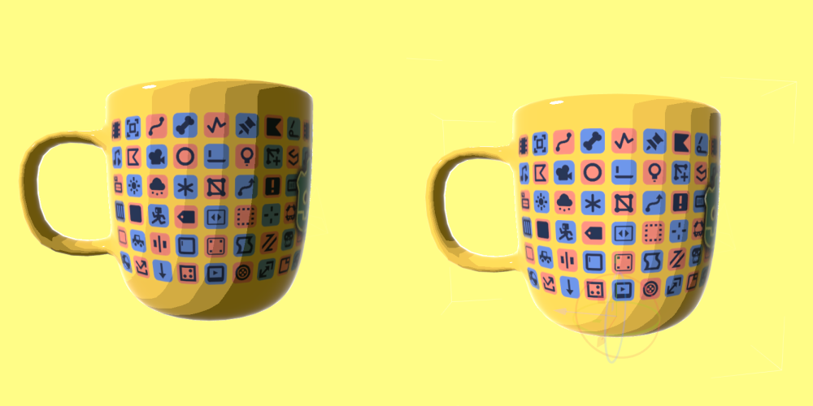
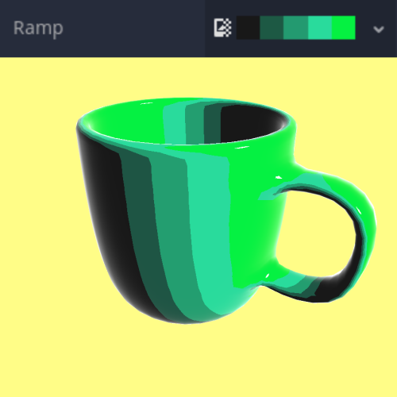
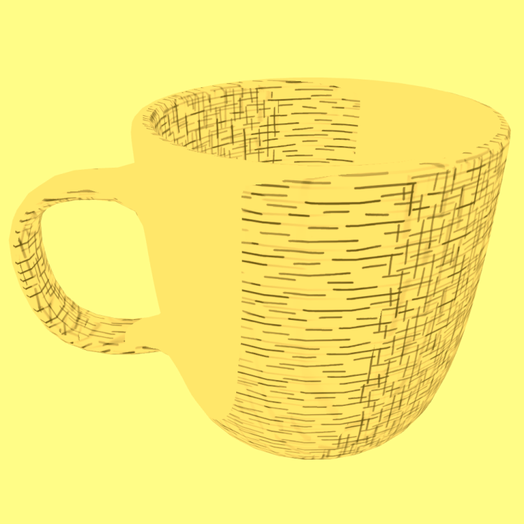

# Flexible Toon Shader for the Godot Engine

## Table of contents

* [Features](#features)
* [Installation](#installation)
  * [Godot Asset Library](#godot-asset-library)
  * [Download from GitHub](#download-from-github)
* [Settings](#settings)
* [Toon Hatching Shader](#toon-hatching-shader)
* [Troubleshooting](#troubleshooting)
* [License](#license)

## Features

&emsp;🤸Flexibility through parameters like number of cuts/bands, steepness, and wrap  
&emsp;🎨 Supports custom color ramps  
&emsp;🌈 Affected by the colors of light sources and ambient light in the scene  
&emsp;💡 Allows for multiple light sources  
&emsp;⛱️ Supports shadows and attenuation  
&emsp;✨ Visual extras like specular reflections and rim lighting  
&emsp;🖼️ Supports textures for albedo and specular

**New**: 
&emsp;✏️ Experimental [toon hatching shader](#toon-hatching-shader) (available as a separate material)

## Installation

### Godot Asset Library

The shader is available in the [Godot Asset Library](https://godotengine.org/asset-library/asset/873) directly from the editor.

### Download from GitHub

Simply download the repository contents and drop the `addons` folder in your project root. You can find the toon shader material at `addons/flexible_toon_shader/FlexibleToonMaterial.tres`. The (experimental) toon hatching shader material is located at `addons/flexible_toon_shader/HatchToonMaterial.tres`.

*Note*: The repository contains an example scene at `addons/flexible_toon_shader/example`. You can remove this folder if you want to keep the install size small.

## Settings

The following shader parameters are available:

* `albedo`

Base color of the mesh.

* `albedo_texture`

Use a texture for the base color (will be multiplied with `albedo`).

* `clamp_diffuse_to_max`

When using multiple light sources, instead of adding every light, the diffuse color will use only the brightest light. This can make a scene with multiple light sources look more consistent (see below).

Example with `clamp_diffuse_to_max` enabled (left) and disabled (right).

* `cuts`

The number of *cuts* used for toon shading. Set to `1` for "classical" toon shading with a single hard border.

* `wrap`

Adds a bias to the calculation for diffuse shading, essentially moving the halfway point between the lit and dark sides of an object.

Shading of an object with `wrap` set to `0` (left) and `0.4` (right). Note that the position of the light is the same in both cases.

* `steepness`

Controls how steep the transition from lit to dark areas should be, essentially shrinking the widths of all bands. (Has no effect when `cuts` is set to `1`).

* `use_attenuation`

Allows objects to cast shadows on the mesh. Also needed for proper attenuation when using `OmniLight` nodes in your scene.

*Note*: You might need to set `wrap` to a slightly negative value (e.g. `-0.1`) for this to work properly.

* `use_specular`

Adds a specular reflection blob based on Blinn-Phong shading.

* `specular_strength`

Brightness of the specular blob. Does not change its size.

* `specular_shininess`

Controls the size of the specular blob. Larger values will result in a smaller blob.

* `specular_map`

Use a texture for specular reflection. This will be multiplied with the specular result so bright areas will be more reflective than dark areas.

* `use_rim`

Enables simple rim lighting.

* `rim_width`

Controls the width of the rim. Note that *smaller* values will result in a *larger* rim.

* `rim_color`

Custom color of the rim effect to blend with the light color. The alpha component controls the brightness of the rim.

* `use_ramp`

Use a custom ramp texture for coloring each band.

*Note*: If you're sampling from a texture with a discrete palette of colors, make sure to adjust the `cuts` parameter accordingly.

Ambient light, light color and parameters like `albedo` will affect the output color of the ramp. If you want to preserve the colors exactly as they are, make sure to either disable all ambient light sources or uncomment `render_mode ambient_light_disabled` in the shader file and make sure all lights in your scene are white.

* `ramp`

(Horizontal) texture used for the color ramp. Godot's built-in `GradientTexture` can be used.

## Toon Hatching Shader

The toon hatching shader is similar to the main toon shader but takes an additional *single rectangular* texture input. This pattern is then repeated to create a (cross) hatching effect.

The shader is available as a *separate* material at `addons/flexible_toon_shader/HatchToonMaterial.tres`.

## Troubleshooting

### `use_attenuation` looks weird/too bright.

You may need to set `wrap` to a slightly negative value, e.g. `-0.1`.

### My color ramp doesn't look like the texture.

If you use a pixelated texture as the palette for the color ramp, make sure you import it with *Repeat* and *Filter* disabled. Also make sure no ambient light or light colors are changing the colors of the object. You can also switch between triplanar mapping and UVs with the flag `use_triplanar`.

## License

This repository is licensed under the MIT license.

The Godot Engine Logo is used in the example scene:

Godot Engine Logo Copyright (c) 2017 Andrea Calabró

This work is licensed under a Creative Commons Attribution 4.0 International License (CC-BY-4.0 International) https://creativecommons.org/licenses/by/4.0/.

Godot Engine icons are used in the example scene. The Godot Engine is licensed under the MIT license.
